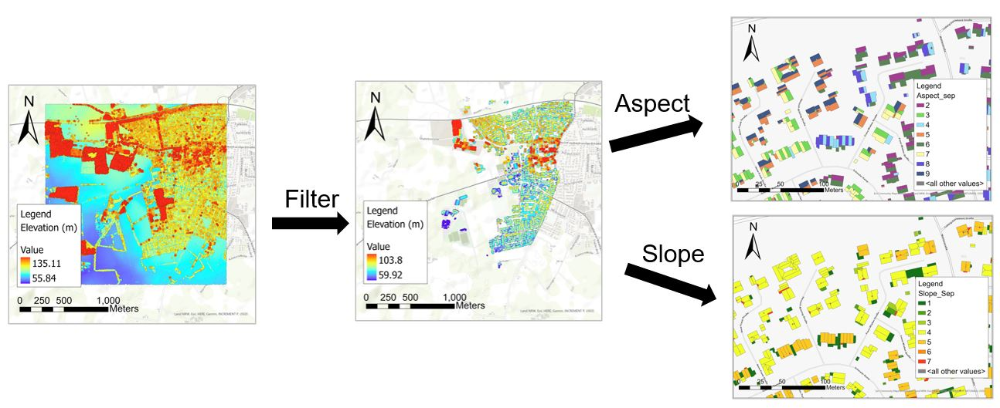

# Roof-based Aspect and Slope Calculation

This repository includes the Jupyter Notebook (`RASC.ipynb`) for calculating roof-based aspect and slope from point clouds. The file explains how the `RASC.ipynb` works. The calculation is part of the student project "Graph-Based Roof Classification". The below figure shows the calculation results of the student project. However, the filtering point clouds part is not included in the Jupyter Notebook.

# Pre-requisites

- ArcPy 2.8
- Python 3.7.10

# Workflow

In this study, we follow the workflow from previous research (Adeleke and Smit, 2020; Boz et al., 2015; Gergelova et al., 2020). The RASC Jupyter Notebook will execute the workflow in Python.

# Data Preparation

 Due to copyright reasons, the repository cannot provide the point clouds and the shapefile used in the project. Please prepare the below 2 files of your study area for running the codes in the  `RASC.ipynb`.

1. A filtered LAS dataset (`.lasd`) which contains the point clouds of the areas where only houses are located.

2. A roof outline shapefile (`.shp`). The roof shapefile needs to have a column called "ID_Sep" with unique integer values for identifying each roof.

# How to use this repository?

1. Please check `# Pre-requisites` and `# Inputs`. 

2. Download the repository to your working directory.

3. Open the `RASC.ipynb` Jupyter Notebook.

4. Set your own working directory in the first cell. 

5. (Optional) If you would like to use your own reclassify classes, please modify the `remap` parameters as well.

5. Run `RASC.ipynb`.

# References
Adeleke, A. K., Smit, J. L., 2020. Building roof extraction as data for suitability analysis. Applied Geomatics, 12(4), 455-466.

Boz, M. B., Calvert, K., Brownson, J. R., 2015. An automated model for rooftop PV systems assessment in ArcGIS using LIDAR. Aims Energy, 3(3), 401-420.

Gergelova, M. B., Kuzevicova, Z., Labant, S., Kuzevic, S., Bobikova, D., Mizak, J., 2020. Roof’s Potential and Suitability for PV Systems Based on LiDAR: A Case Study of Komárno, Slovakia. Sustainability, 12(23), 10018.
