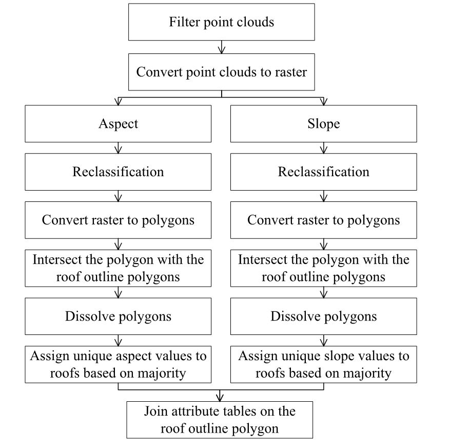

# Roof-based Aspect and Slope Calculation
This file explains how the RASC.ipynb works. The calculation is part of the student project "Graph-Based Roof Classification".

# Pre-requisites
- ArcPy 2.8
- Python 3.7.10

# Workflow
In this study, we follow the workflow from previous research (Adeleke and Smit, 2020; Boz et al., 2015; Gergelova et al., 2020). The RASC Jupyter Notebook will execute the workflow in Python.

# References
Adeleke, A. K., Smit, J. L., 2020. Building roof extraction as data for suitability analysis. Applied Geomatics, 12(4), 455-466.

Boz, M. B., Calvert, K., Brownson, J. R., 2015. An automated model for rooftop PV systems assessment in ArcGIS using LIDAR. Aims Energy, 3(3), 401-420.

Gergelova, M. B., Kuzevicova, Z., Labant, S., Kuzevic, S., Bobikova, D., Mizak, J., 2020. Roof’s Potential and Suitability for PV Systems Based on LiDAR: A Case Study of Komárno, Slovakia. Sustainability, 12(23), 10018.
